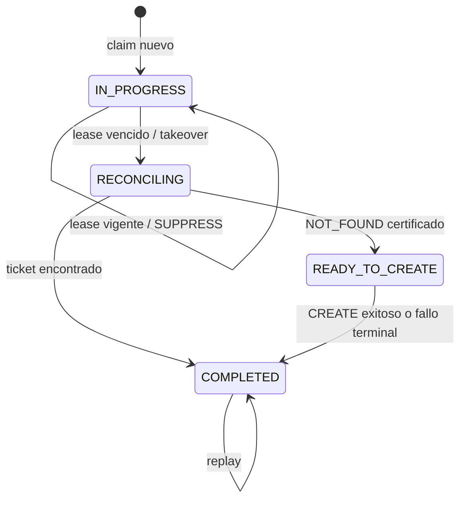

# Arquitectura de recuperación

## Responsabilidades

- Kafka conserva y entrega `integration.commands`; no decide idempotencia.
- PostgreSQL conserva payload, resultado terminal, propietario, vencimiento y conteo de recuperación.
- `integration-worker` reclama, renueva, reconcilia y publica exactamente un resultado terminal por ejecución lógica.
- ServiceNow expone creación y búsqueda por `u_event_id`/clave de correlación.
- El modo operativo es persistente y no depende de que el pod conserve memoria.

## Estado de un comando

Un timeout o error de lookup no autoriza `CREATE`; conserva el claim para otra reconciliación.

## Barrera de arranque

En `pull_restart`, readiness permanece `DOWN` mientras el coordinador adquiere y procesa el backlog recuperable. Cuando termina el barrido inicial, abre consumo normal y readiness cambia a `UP`. En `standby`, el proceso y sus endpoints administrativos pueden estar vivos, pero la ruta de comandos permanece suspendida.

## Dependencias mínimas

- Kafka
- PostgreSQL
- ServiceNow o su mock

El resto de la plataforma no debe ser requisito para iniciar este componente.

