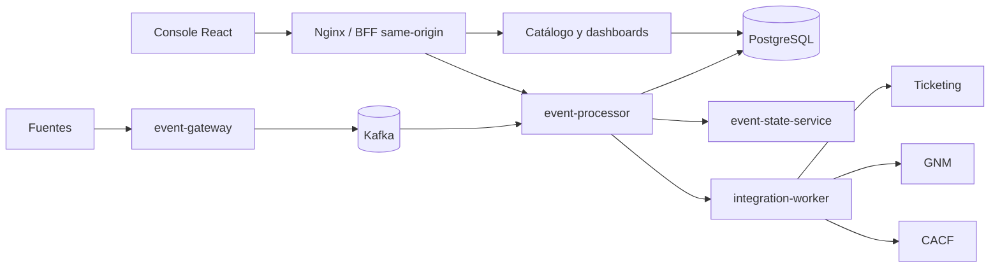

# Arquitectura

## Vista de contexto

La plataforma recibe eventos por `event-gateway`, procesa reglas y
enriquecimiento en `event-processor`, persiste estado en PostgreSQL/OpenSearch,
y entrega comandos a `integration-worker`. La consola React y los dashboards
consumen APIs same-origin mediante Nginx/BFF; no acceden directamente a bases de
datos ni a hosts internos.

## Componentes

| Área | Componente | Responsabilidad |
|---|---|---|
| Entrada | `event-gateway` | Normalización, aceptación e idempotencia de eventos |
| Procesamiento | `event-processor` | Reglas, políticas, inventario, correlación, blackouts, AIOps y routing |
| Estado | `event-state-service` | Estado de eventos, lifecycle, cuarentena e historial |
| Integraciones | `integration-worker` | Ticketing, GNM y CACF con outbox y resultados |
| Administración | `event-management-console` | React/Vite, navegación, formularios y operaciones |
| Dashboards | `oem-dashboards`, `oem-dashboards-api` | Consultas y visualización operacional |
| Datos | PostgreSQL, Kafka, OpenSearch | Persistencia, transporte y búsqueda |

## Flujo de datos

## Integraciones y límites

- Los secretos se consultan por referencia; no se devuelven valores sensibles
  en DTOs ni se escriben en logs.
- El frontend usa rutas relativas y cabeceras de tenant/actor cuando el contrato
  lo exige. No usa `localhost` del navegador para acceder a servicios internos.
- Las mutaciones administrativas usan ETag/`If-Match` cuando el recurso lo
  define y deben reconciliar respuestas inciertas mediante una lectura.
- Los mocks de ServiceNow, GLPI, AIOps y MockSecrets son aislados y no
  representan proveedores productivos.

Para el detalle por integración, consultar
[system-integration-instances.md](system-integration-instances.md) y los
documentos de cada servicio.
