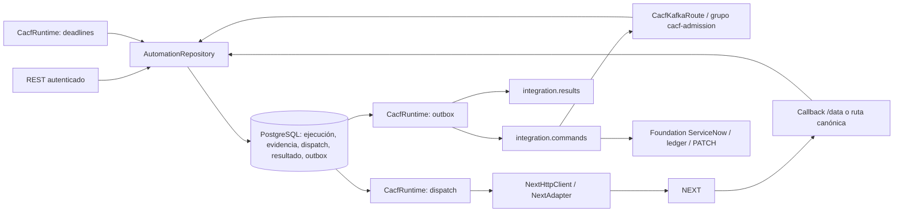

# Arquitectura CACF — generación local 2026-09-08

> OS_11: el perfil optativo y la coordinación de resultados/cierres se documentan en
> [Lifecycle orchestration](../event-processor/lifecycle-orchestration.md). El alcance inicial descrito abajo permanece para rutas sin ese perfil.

CACF reside en integration-worker (Java 21, Quarkus y Apache Camel). Reutiliza
PostgreSQL y los tópicos integration.commands, integration.results y events.dlq.
La admisión propia separa el commit Kafka del consumidor histórico. ServiceNow
conserva la propiedad de las mutaciones ITSM mediante su cliente y ledger existentes.

## Secuencia y transacciones

1. REST o Kafka validan el contrato canónico. accept inserta ejecución, intención
   CREATE y, si existe ticket, comando holding en una misma transacción JDBC.
2. claimDispatch bloquea una intención pendiente con SKIP LOCKED, la marca IN_FLIGHT
   y confirma antes de HTTP. CREATE establece SUBMITTING y submitted_at.
3. Se guarda XML saliente; HTTP se ejecuta fuera de la transacción de claim.
   La respuesta se persiste junto al estado SENT o REVIEW del despacho.
4. Un 2xx con XML seguro pasa a SUBMITTED. Esta comprobación es sintáctica:
   no interpreta StatusCode ni Acknowledge funcionales de la respuesta síncrona.
5. Acknowledge_Create correlacionado establece IN_PROGRESS, ProviderID y deadline
   mediante COALESCE. Los ACK repetidos no amplían el plazo. Se agenda TKTUPDATE
   cuando hay ProviderID y ticket y la ejecución permanece activa.
6. Un callback terminal bloquea la ejecución, guarda evidencia y genera resultado,
   outbox y eventual comando ITSM en una transacción. Solo después responde 200.
7. El publicador envía el primer pendiente por sequence_id y marca published tras
   el envío. Un fallo revierte esa marca. Puede repetir el mensaje si Kafka recibió
   el envío pero el commit SQL no terminó: los identificadores permanecen estables.

## Concurrencia y recuperación

Cada instancia tiene tres tareas periódicas con retraso fijo de un segundo:
despacho HTTP, expiración y publicación. El despacho toma un trabajo por pasada;
la publicación intenta hasta 100 y la expiración bloquea hasta 100 ejecuciones.
La fila de ejecución serializa callbacks y vencimientos; execution_id único en
resultados impide dos resultados persistidos. El publicador toma únicamente el
menor sequence_id global pendiente: conserva orden de intenciones a cambio de
bloqueo del resto si la primera no se publica.

Un IN_FLIGHT incierto no vuelve a PENDING automáticamente. El watcher lo marca
REVIEW al vencer su plazo; sin ACK la ejecución vence. Si un ACK llegó antes de
la respuesta síncrona, esta última no rebaja IN_PROGRESS a SUBMITTED ni reemplaza
la aceptación por un fallo de envío. Un terminal persistido no se revierte.
No existe transacción distribuida SQL/Kafka/HTTP ni garantía exactly-once externa.

## Límites de responsabilidad

CACF no crea tickets: requiere un número existente o asociación posterior. No
porta CLEAR, DB2, IPCenter, failover legacy ni cierre automático de tickets. El
runtime de certificación contiene PostgreSQL/Kafka reales y mocks HTTP. La
proyección event-state-service y los proveedores reales no están certificados
por esta generación. Véanse validation.md y defect-prevention.md.
