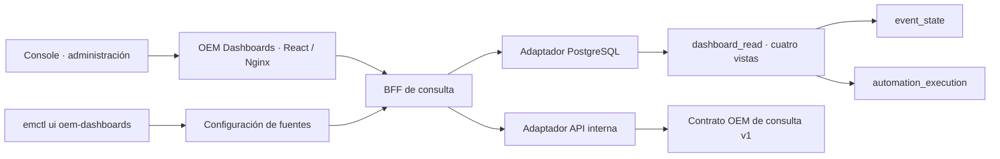

# OEM Dashboards — foundation 0.1.0

Fecha: 2026-09-10. Implementación inicial de los cuatro dashboards de operación de
OS_06_01.DES; no certifica el frontend suite completo ni ingesta.

## Evidencia revisada y decisiones

Se revisaron el árbol de servicios, Compose, CLI, migraciones 001–017 y documentación
local de Processor, ESS, ServiceNow, GNM y CACF. Se contrastaron los PKC locales
`EventManagement_OS_06_01_DES_Frontend_Layer_PKC_v1.0.0.zip` (architecture,
decisions-adr y knowledge-base) y `EventManagement_Project_Global_Status_PKC_v1.0.0_2026-09-10.zip`.
Los paquetes describen diseño y evidencia histórica; el código local vigente
determina las columnas y estados disponibles. No se declara revisión exhaustiva
línea por línea de todos los servicios ni acceso a una KB remota.

ADR-DASH-001: prevalece la especialización de ADR-FE-001/002/009: Console administra;
OEM Dashboards consulta operación. Se conserva el módulo frontend y se sirve en el Nginx existente de Console, con enlace desde
Administración. ITSM existente permanece en 8088 y Console en 8090. El nuevo servicio
usa 8091, evitando una sustitución implícita de la UI mock certificada.

ADR-DASH-002 (ajustada por solicitud del usuario): React/TypeScript/Vite y tokens visuales existentes. Un solo Nginx, en event-management-console, sirve Console en el puerto interno 8080 (host 8090) y Dashboards en 8091. Dockerfile.shared construye ambas SPAs. Nginx sirve la SPA
y envía `/api/dashboards/*` al BFF. Python 3.12 + psycopg implementa el BFF de lectura,
sin acoplar consultas a los consumidores Kafka Java. Es una decisión nueva de esta
foundation; su HTTP server estándar está destinado a laboratorio detrás de Nginx,
no a capacidad/seguridad de producción.

ADR-DASH-003: puerto de consulta común, con adaptadores `postgresql` (predeterminado)
e `internal-api` (`api` como alias CLI). No fallback automático, OpenSearch ni llamadas
directas a ServiceNow/Everbridge/NEXT. API significa API **OEM**, no API del proveedor.
Una API interna futura debe implementar el contrato versionado de esta entrega.

ADR-DASH-004: `dashboard_read` es la frontera SQL estable. Se reutiliza la misma
base PostgreSQL; **no se crean cuatro bases ni copias de los datos**. Migración 018
aditiva después de 002, 008 y 017. Las vistas no son materializadas: muestran el
estado actual confirmado por los servicios, sin pipeline nuevo de ingesta.

| Dashboard | Vista | Autoridad | Unidad de conteo |
|---|---|---|---|
| Event Management | dashboard_read.events | event_state | Agregado event_key |
| Ticketing | dashboard_read.ticketing | event_state.servicenow_status | Evento con integración ITSM |
| GNM | dashboard_read.gnm | event_state.gnm_status | Evento con integración GNM |
| CACF | dashboard_read.cacf | automation_execution | Ejecución execution_id |

Ticketing/GNM no cuentan tickets/incidentes únicos, intentos ni solicitudes históricas.
`lastUpdatedAt` en esos módulos es el timestamp del agregado, no una confirmación del
reloj del proveedor. CACF usa `customer_code` como cliente, mientras ESS usa `tenant`:
no se presume una equivalencia global entre ambos identificadores.
COMPLETED con outcome UNKNOWN no se etiqueta como éxito. No se inventa un SLA,
latencia, tasa de ingesta o gráfico histórico sin datos suficientes.

ADR-DASH-005: UI muestra fuente efectiva, fecha de consulta, última actualización,
conteo/distribución por estado, búsqueda de identificadores, cliente y estado exactos,
paginación y guía operativa por dominio. Error y vacío son estados distintos; cambiar
filtros elimina resultados previos. La guía no afirma verificaciones automáticas.

ADR-DASH-006: CLI prueba fuente antes del cambio, guarda backup y reemplaza JSON
atómicamente bajo lock; prueba de nuevo y revierte ante fallo. BFF lee configuración
en cada consulta: cambio caliente sin reiniciar contenedores. Peticiones en curso
terminan con la fuente que ya capturaron. Un cambio global limpia excepciones por módulo.
El JSON sólo contiene modos; secretos y endpoints quedan en variables del servidor.

## Siguiente desarrollo

Ingesta separada, proyecciones históricas, métricas de retries/deadlines, detalle
operativo y mapeo tenant/customer_code. SSO, RBAC, aislamiento por tenant, servidor
HTTP de producción, cuotas, pool y telemetría quedan pendientes. El filtro de cliente
es consulta, **no autorización**. Esta foundation se expone sólo en loopback.

## Demostración desplegable

`scripts/dashboards/seed-demo.sql` es opt-in e idempotente. Añade 27 registros
al esquema `dashboard_demo` y los incorpora a las cuatro vistas por UNION ALL.
Todos usan cliente `DEMO-DASHBOARDS` e identificadores demo-dashboard.
No inserta ejecuciones en tablas CACF, ni eventos operativos, ni outboxes;
los workers no pueden despachar estas demostraciones. Borrar las filas de
`dashboard_demo.records` retira exclusivamente estos datos; reaplicar 018
restaura las vistas canónicas sin demostración.

## Módulos operativos adicionales

- [Data Collection](data-collection.md): diario de originales del gateway, migración 025, vistas de día e histórico.
- [API Management](api-management.md): registro de APIs, disponibilidad y ciclo de servicios vía frontend-management-api en el mismo Nginx.
