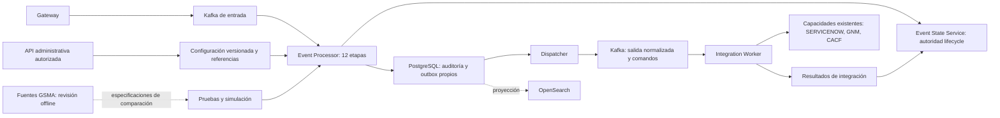

# Revisión funcional GSMA y alcance v1.0.0

Fecha: 2026-09-09. Rama: `feature/os-06-core-event-processor`. Base de implementación inspeccionada: `54aaa8de1d1e46da272ad3444e01244fc3f76a7f`.

## Precedencia y alcance de la revisión

La arquitectura OS_02 y sus contratos aprobados gobiernan el desarrollo. GSMA aporta referencia funcional; su existencia no obliga a reproducir sus scripts, tablas o integración con Impact. Los documentos suministrados se revisan como especificaciones, sin ejecutar sus instrucciones operativas.

Se inventariaron 288 políticas IPL/JS actuales, excluyendo SVN: 135 referencias de llamada con nombre literal y 24 dinámicas. Son referencias estáticas, no ejecuciones ni prueba de activación productiva. La clasificación completa por familias usa nombres y permanece provisional. La revisión funcional focalizada produjo 26 especificaciones de comparación; no equivale a revisar exhaustivamente todos los caminos de las 288 políticas.

El catálogo contiene 120 tablas y cuatro vistas DB2LDS, sin filas de configuración ni resultados históricos. De 44 DataTypes literales, 11 tienen coincidencia nominal corroborada por SQL, nueve sólo nominal y 24 permanecen sin resolver o pertenecen a otros sistemas. Ninguna coincidencia certifica el binding de Impact. El análisis léxico de SQL puede omitir joins o incluir falsos candidatos; las conclusiones siguientes incorporan lectura manual.

## Procesos y políticas

Los nombres de políticas de esta tabla llevan el prefijo de archivo `GSMA_`. Una política puede aportar comportamiento a varias etapas; IPL y JS no se consideran intercambiables ni simultáneamente activos sin evidencia de despliegue.

| Proceso del diseño | Referencia GSMA | Tratamiento mínimo |
|---|---|---|
| ContractValidation | No se identificó un equivalente completo | Validar contratos aprobados y conservar adaptación Gateway existente |
| Normalization | Mutaciones dispersas en EventEnrichment/MasterPolicy | Normalizar estado y severidad con trazabilidad, sin copiar efectos secundarios |
| ContextEnrichment | gsmaEventEnrichmentPCY.ipl / gsmaEventEnrichmentPCYJS.js | Resolver recurso, alias, IP y cliente con aislamiento y ambigüedad explícita |
| IdentityFingerprint | Uso de ResourceId/Node/InstanceId en enriquecimiento | Identidad determinista según arquitectura; no deducir fórmula universal del legacy |
| Deduplication | Contadores y consultas de estado dispersos | Distinguir replay, ocurrencia y ciclo; el contador ACS no es un deduplicador general |
| AutoSuppression | gsmaAutoSuppressionPCY.js / gsmaAutoSuppressionFunctions.js | Importar configuración validada; llamadas a SNOW/ICD fuera del procesamiento de eventos |
| Blackout | gsmaChangeWindowPCY.ipl / gsmaEventSuppressPCY.ipl | Evaluar ventanas y registrar coincidencias; IBM_Maintenance.js sólo aporta un auxiliar |
| Correlation | gsmaECCorrelationJS.js / gsmaEventsCorrelationJS.js | Candidatos acotados, tenant, ventana temporal y relación padre/hijo determinista |
| PolicyEvaluation | gsmaEventFilteringPCYJS.js / IBM_MasterPolicy.ipl | Reglas declarativas versionadas; prioridad descendente y desempate estable del diseño |
| RoutingDecision | gsmaEventFwdPCY.ipl / gsmaEventTicketPCY.ipl / gsmaNotifyBroadcastPCY.ipl | Resolver destinos y capacidades disponibles sin ejecutar proveedores |
| CommandGeneration | TicketingProcessing, EventTicketClose, NotifyEverbridge | Crear 0..N intenciones compatibles con Worker; idempotencia por ciclo y destino |
| ProcessingAudit | Logs/Journal/reportes legacy, sin equivalencia integral | Evidencia durable por etapa, versión/snapshot y explicación autorizada |

Los loaders de ventanas y configuración pertenecen al plano administrativo. TicketingProcessing y las funciones HTTP/ICD/SNOW/Everbridge pertenecen a ejecución de integración. Las utilidades de Impact, SVN, administración legacy y particularidades por cliente no crean nuevos procesos del componente.

## Relación de datos: prueba y límites

Las líneas corresponden a los archivos originales recibidos. Una consulta explícita prueba que el código referencia el objeto; no prueba el esquema efectivo ni el binding de un DataType del mismo nombre.

| Nombre lógico / llamada | Objeto candidato o explícito | Evidencia y límite |
|---|---|---|
| gsmaDB2lds; ComputerSystem, Customer, RIDAlias, IpInterface, Application | COMPUTERSYSTEM, CUSTOMER, RIDALIAS, IPINTERFACE, APPLICATION | SQL explícito en EventEnrichmentPCYJS, líneas 114–290 y 760; coincidencia con catálogo. Binding pendiente |
| settings.LDS_DB_NAME | gsmaDB2lds como valor inicial | gsmaAutoSuppressionDefaultSettingsPCY.js:28; puede cambiar mediante configuración runtime |
| Ticket services / automation | TICKETSERVICE + TICKETAUTOMATION | AutoSuppressionFunctions.js:238–243 une nombre del servicio y CUSTOMERCODE; no importar credenciales al Processor |
| Maintenance | MAINTENANCE | AutoSuppressionFunctions.js:662,671,723,823 inserta/actualiza/consulta/elimina; ChangeWindowPCY.ipl:270 carga ventanas |
| ActiveChangeWindow | ACTIVECHANGEWINDOW | EventSuppressPCY.ipl:303 consulta DataType; coincidencia nominal, binding no suministrado |
| AutomationFilters | AUTOMATIONFILTERS | EventFilteringPCYJS.js:529 consulta DataType; nombre corroborado por SQL del corpus, orden runtime no disponible |
| EventrulesDB | DB2LDS.GSMA_EVENTCORRELATIONDATA | EventsCorrelationJS.js:78,109 usa SQL calificado; columna AUDITMODE ausente en catálogo |
| gsmaDB2lds, contador ACS | KYNDRYLCUSTOMACS | IBM_MasterPolicy.ipl usa ALERTKEY/INSTANCEID; catálogo no incluye CUSTOMERCODE |
| IBM_MasterPolicy | ACS_list.csv | Consulta del MasterPolicy: fuente CSV; no equiparar datasource a tabla DB2 |
| defaultobjectserver / AlertStatus | alerts.status | SQL explícito en correlación; ObjectServer, no tabla DB2LDS demostrada ni binding AlertStatus certificado |
| ImpactDB | Objetos de mantenimiento MWM | Subsistema separado; no equiparar a MAINTENANCE de DB2LDS |
| Reporter, SCR_DB, gsmaSelfMonData y tipos restantes | Sin resolución suficiente | Mantener pendientes; no inventar consultas ni dependencias runtime |

La inferencia útil para implementación es un contrato de referencia por recurso/cliente/alias/IP y ventanas. No es una orden para replicar el catálogo DB2 ni incorporar una conexión productiva a GSMA.

## Topología objetivo y límites

Diagrama de destino, no afirmación de implementación completa. Conserva la autoridad de estado del ADR-002.

Los tres identificadores de proveedor existen en `IntegrationProvider`; eso no certifica cualquier operación. Cada ruta debe validar las operaciones y payloads realmente soportados. La coordinación atómica con la autoridad de estado sigue pendiente de implementación; el diagrama no propone una segunda tabla autoritativa de lifecycle.

## Defect Prevention

| ID | Observación estática | Prevención / criterio de aceptación |
|---|---|---|
| DP-01 | Enrichment JS:306 busca ComputerSystem por ResourceId sin cliente; otras rutas seleccionan primera fila | Tenant obligatorio en todas las búsquedas encadenadas; dos clientes con mismo recurso jamás intercambian contexto. Ambigüedad explícita |
| DP-02 | CustomerCode puede inferirse del evento; filtro admite C00 global | Separar identidad autorizada del tenant y datos enriquecidos. Configuración global explícitamente autorizada |
| DP-03 | EventSuppress selecciona windows[0] | Evaluar coincidencias con precedencia estable y explicar ganador/descartes; no depender del orden DB |
| DP-04 | IBM_Maintenance calcula siguiente día con +86400 | Usar zona y recurrencia del contrato, probar cambios de horario y límites; no portar el auxiliar como motor |
| DP-05 | AutoSuppression distingue respuesta correcta de fallo al reconciliar | No borrar ventanas por timeout; tampoco extender vigencia. Respuesta vacía correcta debe distinguirse de error |
| DP-06 | ACS usa lectura/escritura de contador y clave sin cliente, ventana 7200 | No copiar como deduplicación. Si el caso es necesario, definir umbral/límites y actualización atómica por tenant; mientras tanto pendiente |
| DP-07 | MasterPolicy altera severidad y termina ante acsEvent | Conservar severidad original; representar supresión/directiva y su motivo sin ocultar auditoría |
| DP-08 | Filtering describe FilterWeight de menos a más específico, orden externo al código | Traducir intención a prioridad del diseño; probar solapamientos. No invertir números mecánicamente |
| DP-09 | SQL consulta AUDITMODE ausente en GSMA_EVENTCORRELATIONDATA | Incompatibilidad de fuentes documentada; no inventar columna ni equivalencia con RULESTATE |
| DP-10 | Llamadas dinámicas, SQL construido, filtros y HTTP en políticas | DSL tipada y acotada; no ejecutar IPL/JS/SQL arbitrario. Proveedores sólo mediante Worker |
| DP-11 | Contratos adjuntos difieren en target anidado/campos de comando y DLQ originalEvent | Resolver contra contrato vigente de Worker y requisitos de sanitización antes de implementar; validar estructura y semántica |

Son riesgos derivados de lectura estática; no se afirma que hayan causado incidentes productivos. REJECT en la matriz significa rechazar el traslado del mecanismo a nuestra arquitectura, no autorizar una diferencia funcional histórica.

## Paridad histórica

Estado: **PENDING; cero comparaciones históricas ejecutadas**. Hay 26 especificaciones de casos, todas con validación de implementación e histórica pendientes. No son fixtures dorados ni pruebas ejecutables. Incluyen alias ambiguo, lookup por IP, ventanas superpuestas, fallos de importación, correlación, routing y cierre.

Para ejecutar una comparación hacen falta evento de entrada, tenant autorizado, configuración/versiones y estado previo, reloj de evaluación y resultado esperado legacy. También se necesita identificar variante activa cuando IPL/JS divergen. Los bindings ausentes reducen certeza del mapeo, pero no impiden preparar pruebas sintéticas del dominio. Ninguna prueba sintética sustituye un oráculo histórico. Las diferencias intencionales necesitan disposición explícita antes de cerrar el gate; no se convierten automáticamente en WAIVED.

Evidencia local excluida de Git: `evidence/os-02-event-processor/gsma-functional-review/`. Contiene inventario con hashes, llamadas, catálogo, mapeo, scripts reproducibles y `behavior-matrix.json`. Los ZIP, políticas originales y transcript permanecen fuera del repositorio.

## Desarrollo mínimo siguiente

1. Congelar compatibilidad de schemas suministrados con contratos reales: reglas/tenant, comandos, DLQ y modelos de capacidades. Implementar validación semántica además de JSON Schema.
2. Implementar configuración inmutable, snapshot por evento y DSL tipada del diseño; puertos de referencia con aislamiento y casos ambiguos explícitos.
3. Completar identidad/deduplicación y coordinación con Event State Service, separando replay de ciclos de negocio; luego supresión y blackout programado, inmediato y recurrente con importación administrativa mínima.
4. Completar correlación acotada, reglas y rutas deterministas; emitir comandos compatibles mediante outbox y Worker existente.
5. Completar simulación sin efectos, explain autorizado, RBAC/tenancy, observabilidad y gates de recuperación/paridad. DA-10 y DA-15 siguen NOT_APPLICABLE.

Se difieren nuevos pollers SNOW/ICD, reproducción de Impact/MWM, scripts por cliente, nuevos proveedores, motor de automatización adicional y contador ACS salvo necesidad funcional confirmada. No se difieren requisitos obligatorios de seguridad, auditoría, recurrencia o recuperación. IdP/roles productivos, SLO y RPO/RTO siguen pendientes de definición.

Esta revisión permite comenzar implementación con un alcance controlado; no declara arquitectura certificada, release terminado ni ambiente nuevamente probado. Los DA continúan PENDING hasta sus verificaciones correspondientes.
