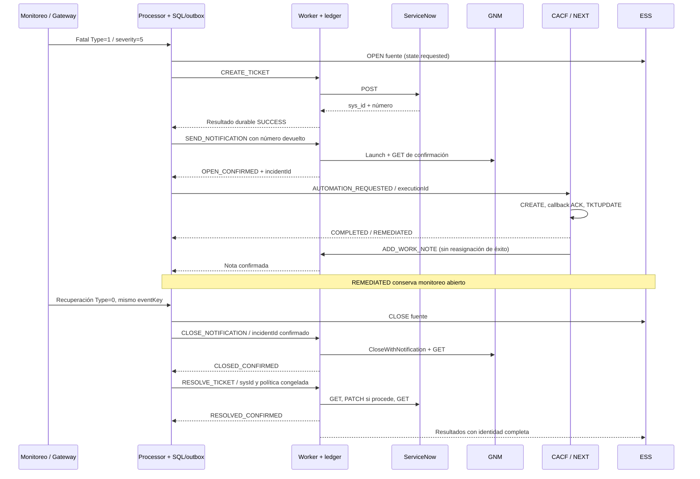

# OS_11_01.IMP — Orquestación durable de ciclo

## Decisión de arquitectura

Processor coordina dependencias de negocio en su transacción PostgreSQL; Worker
conserva ejecución, claims, reconciliación y confirmación de proveedores; ESS
proyecta resultados y recuperación. No se añade un servicio ni se escribe ESS
desde el harness. Una ruta sin `parameters.lifecycle` sigue creando sólo el ticket.

La unidad de coordinación es `(tenant, correlationGroupId)`, donde groupId incluye
el ciclo. El eventId/eventKey de comandos representan esa situación. El documento
`event_processor.lifecycle`, metadata de comandos y evidencia del procesamiento
conservan `sourceEventId`, `sourceEventKey`, processingId, configuración original,
commandId/resultId, ticket ID/número, incidentId y executionId. Los miembros y sus
recuperaciones siguen perteneciendo al motor de correlación existente.

## Configuración explícita

En una acción `SERVICENOW/CREATE_TICKET`, junto a `configuration: default` y
`correlationRuleId`, incluir:

```json
{"lifecycle": {
  "notificationGroup": "synthetic-operations",
  "originalAssignmentGroup": "synthetic-human",
  "holdingAssignmentGroup": "synthetic-automation",
  "resolvedState": "resolved-test",
  "closeCode": "monitor-recovered"
}}
```

Esos valores son el **contrato del mock sintético**, no códigos ServiceNow de
producción. Cada instancia debe aportar el valor real de resolución y su código
obligatorio, y registrar el tenant/grupo lógico en GNM. No existe default numérico.
La política implementada es **resolver**, proyectada como `RESOLVED`; nunca se
etiqueta como `CLOSED` el ticket. `RESOLVE_TICKET` lleva sysId, ticketNumber,
expectedState, closeCode y closeNotes generadas desde el ciclo recuperado.
Worker consulta por número, verifica sysId/número, hace como máximo un PATCH y
vuelve a consultar. Sólo confirma `RESOLVED_CONFIRMED` cuando coinciden estado,
código y notas no vacías. En RECONCILE hace sólo GET: no repite un PATCH incierto.

El perfil exige exactamente cinco textos no vacíos de hasta 255 caracteres;
rechaza campos extra, objetos y payload libre. El tenant CACF no admite `:` ni más
de 64 caracteres; resource no excede 255 en estas rutas. No permite proveedores,
operaciones o credenciales arbitrarios. El schema está en
`services/event-processor/src/main/resources/contracts/lifecycle-profile-v1.schema.json`.
La primera configuración del ciclo queda congelada; editar una regla no cambia
comandos ya emitidos ni transforma un ciclo ticket-only en uno orquestado.

## Transiciones y confirmaciones



Los estados durables incluyen TICKET_PENDING, OPEN_PENDING, AUTOMATION_PENDING,
REMEDIATED_AWAITING_RECOVERY, RECOVERED_AUTOMATION_PENDING, CLOSE_PENDING,
RESOLVE_PENDING, SUPPRESSED_PENDING, REVIEW y COMPLETED. `results` conserva el
estado FAILED y error/retryability recibido del Worker; REVIEW señala que la
coordinación no tiene confirmación suficiente para avanzar. Los retries de
proveedor siguen en Worker; no se vuelven a disparar mutaciones desde Processor.
Ausencia de resultado permanece pendiente, nunca se convierte en éxito.

Los resultados GNM se completan con tenant, eventKey, resultId estable y externalId
antes del ledger. Se exige OPEN_CONFIRMED/CLOSED_CONFIRMED, no sólo aceptación del
POST/PUT. CACF exige COMPLETED + REMEDIATED + executionId coincidente y ausencia
de requiresReview. UNKNOWN, TIMEOUT, escalamiento, fallo de envío o proveedor
fallido detienen el avance en REVIEW y mantienen el resultado original.

## Recuperación, grupos y orden

- Antes de confirmar ticket: se conserva recuperación; al llegar el ticket sólo
  se emite resolución, sin abrir GNM ni iniciar CACF.
- Con GNM ya emitido: se espera su confirmación y se cierra ese incidente; no se
  inicia CACF después de la recuperación.
- Con CACF ya emitido: no hay cancelación soportada. Se espera su resultado y la
  nota confirmada antes de cierres; UNKNOWN/fallos requieren revisión.
- El clear de un miembro no cierra el grupo mientras queden ACTIVE. EXPIRED no
  demuestra recuperación: un grupo que resuelve con miembros expirados queda en
  REVIEW. La expiración de ventana no justifica cerrar proveedores.
- Tras resolución de miembros, un nuevo PROBLEM abre otro groupId/ciclo; las
  identidades del ciclo previo y sus efectos permanecen separadas.
- El blackout conserva correlación/recuperación pero suprime nuevas intenciones,
  incluidos cierres. Un clear posterior elegible puede continuar cierres pendientes.
  No hay reevaluación autónoma al vencer blackout; tampoco se retira un comando
  que ya cruzó la frontera durable antes de la supresión.
- Duplicados de resultados no crean nuevas intenciones. Resultados fuera de orden,
  de otra identidad o sin confirmación no adelantan dependencias. ESS conserva
  sus confirmaciones terminales frente a aperturas/notas tardías del mismo agregado.

## Persistencia y replay

Aplicar **020-processor-lifecycle.sql** después de 009–017 y
**021-worker-delivery-recovery.sql** después de 004/005/007. La numeración evita
colisión con la migración OEM concurrente. Ambas son aditivas e idempotentes.

020 agrega lifecycle (PK tenant/ciclo), lifecycle_result (resultId único y FK al
ciclo), índice de consulta por ciclo y lifecycle_rejection (topic/partition/offset).
Resultado aceptado, decisión, ledger del comando siguiente y outbox se confirman
juntos bajo el mismo advisory lock por tenant que las entradas del Processor.
El consumidor confirma Kafka después del commit; los fallos SQL se reintentan.
Envelopes inválidos conservan razón y hash en cuarentena, sin bloquear particiones.

021 agrega result_published_at/recovery_published_at al ledger Worker e índice
parcial de entregas pendientes. La finalización del claim deja la entrega pendiente
en la misma escritura SQL. Un publicador recorre resultados persistidos, envía con
acks=all y marca después del envío. También republica el **comando original** de
claims vencidos cada 60 s como máximo; el consumidor ejecuta RECONCILE, nunca un
nuevo CREATE por decisión del publicador. El claim owner sigue protegiendo escrituras.
La ruta inmediata puede publicar el mismo resultado; los consumidores deduplican
por identidad. El historial anterior a 021 se marca entregado al migrar y no se
republica masivamente: reparar historia incompleta requiere revisión explícita.

No se promete exactly-once externo: una aceptación remota sin checkpoint puede
quedar incierta. GNM reconcilia por GET cuando dispone de identidad; ServiceNow
creación usa su reconciliación existente; CACF conserva REVIEW para dispatch
incierto y nunca reenvía CREATE por suposición. El estado durable permite localizar
esa incertidumbre, no eliminarla inventando confirmaciones.

Reversión: deshabilitar rutas lifecycle, drenar/revisar ciclos abiertos y detener
los consumidores nuevos antes de volver a binarios previos. Conservar columnas,
tablas, auditoría y offsets; no hay down destructivo. Una ruta con lifecycle no
puede quedar activa en un Processor anterior que desconozca esos parámetros.

## Runbook y límites

Preparar el laboratorio mediante `python3 testing/run.py certification --name lifecycle-prepare`.
Usa el proyecto Compose `os11-lifecycle`, sin modificar el runtime compartido.
Ejecutar `python3 testing/run.py happy-path`; para reinicio entre NEXT SUBMITTED y
ACK: `python3 testing/run.py certification --name lifecycle-restart`.
Consultar `testing/README.md` para suites de regresión y UC-002.
No limpiar/recompilar los directorios target mientras el laboratorio que los monta
esté en ejecución; la preparación detiene primero esos servicios aislados.

Consultar `event_processor.lifecycle.document`, lifecycle_result, output_outbox y
el ledger Worker por tenant/cycleId. Para REVIEW inspeccionar `reason` y el resultado
de la etapa, contrastándolo con GET del proveedor. No borrar ledger ni publicar
comandos alterados con el mismo commandId. Mantener mappings de casos fallidos para
reconciliación tardía; el harness desactiva únicamente sus reglas.

Dependencias no resueltas:

1. Acordar y verificar valores reales de estado/código de resolución y campos
   adicionales obligatorios de cada instancia ServiceNow; el laboratorio usa un
   contrato sintético explícito.
2. Reparación operativa autorizada de REVIEW, especialmente GNM sin incidentId,
   CACF UNKNOWN/dispatch incierto y resultados históricos incompletos. No hay API
   automática que transforme estas situaciones en éxito.
3. Reevaluación de supresión al vencer la ventana sin una nueva entrada elegible;
   expiración de miembros sin recuperación observada requiere revisión.
4. Registry GNM continúa siendo configuración de arranque, por classpath o archivo
   local `file:`; no existe administración dinámica de tenants en este trabajo.
5. ESS mantiene sus límites actuales: eventKey global, proyección dual con retry
   Kafka y ausencia de outbox ESS. Fuente y situación correlacionada son agregados
   distintos; el estado de integraciones se consulta en `correlation:<groupId>`.
6. Pruebas de fallos se reparten entre unidad/SQL y suites existentes; no todos los
   fallos de red y puntos de crash se certifican E2E. Los reportes de ejecución,
   omitidos y fallos quedan exclusivamente en `evidences/`.
