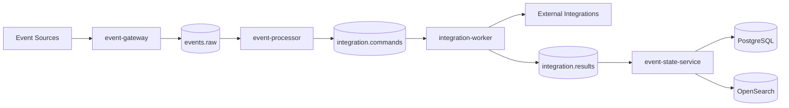

# Event Management OpenSource

Plataforma open source para la recepción, normalización, procesamiento, integración, consolidación y consulta de eventos operativos mediante una arquitectura orientada a eventos.

[](https://GITHUB_OWNER.github.io/event-mgmt-opensource/)
[](LICENSE)
[](docs/project/status.md)

## Descripción

Event Management OpenSource proporciona una arquitectura desacoplada para procesar eventos provenientes de sistemas de monitoreo, automatización e integración.

La plataforma está diseñada alrededor de un flujo event-driven:

```text
Event Source
    ↓
event-gateway
    ↓
events.raw
    ↓
event-processor
    ↓
integration.commands
    ↓
integration-worker
    ↓
integration.results
    ↓
event-state-service
    ↓
PostgreSQL + OpenSearch
```

## Objetivos

* Recibir eventos mediante APIs y webhooks.
* Normalizar eventos provenientes de distintas fuentes.
* Publicar y consumir eventos mediante Kafka.
* Ejecutar integraciones externas de forma desacoplada.
* Consolidar el estado actual de cada evento.
* Persistir estado transaccional en PostgreSQL.
* Publicar proyecciones de búsqueda en OpenSearch.
* Proporcionar infraestructura reproducible mediante Terraform.
* Mantener documentación técnica versionada junto con el código.

## Arquitectura



Consulte la [documentación de arquitectura](docs/architecture/index.md) para conocer los componentes, flujos, decisiones y restricciones del sistema.

## Componentes

| Componente            | Responsabilidad                       | Estado              |
| --------------------- | ------------------------------------- | ------------------- |
| `event-gateway`       | Recibir eventos mediante HTTP         | En desarrollo       |
| `event-processor`     | Normalizar eventos y generar comandos | En desarrollo       |
| `integration-worker`  | Ejecutar integraciones externas       | Validado localmente |
| `event-state-service` | Consolidar y persistir el estado      | Validado localmente |
| PostgreSQL            | Fuente de estado transaccional        | Validado localmente |
| OpenSearch            | Proyección de consulta y búsqueda     | Validado localmente |
| Kafka                 | Backbone de eventos                   | Validado localmente |
| Terraform GCP         | Infraestructura cloud                 | En progreso         |

## Estructura del repositorio

```text
event-mgmt-opensource/
├── applications/       # Servicios y aplicaciones
├── config/             # Contratos y configuración reutilizable
├── docs/               # Documentación publicada en GitHub Pages
├── infrastructure/     # Docker, Kubernetes y Terraform
├── knowledge/          # Paquetes PKC y evidencia histórica
├── scripts/            # Automatización operativa y de desarrollo
├── tests/              # Pruebas entre componentes
├── mkdocs.yml          # Configuración del portal documental
└── README.md
```

## Requisitos

Para ejecutar la plataforma localmente:

* Git
* Java 21
* Maven Wrapper
* Docker Engine
* Docker Compose
* `curl`
* `jq`

Para construir la documentación:

* Python 3.11 o posterior
* `pip`
* MkDocs
* Material for MkDocs

## Inicio rápido

Clone el repositorio:

```bash
git clone https://github.com/GITHUB_OWNER/event-mgmt-opensource.git
cd event-mgmt-opensource
```

Prepare la configuración local:

```bash
cp .env.example .env
```

Levante la infraestructura:

```bash
docker compose \
  --env-file .env \
  -f infrastructure/docker/docker-compose.yml \
  up -d
```

Verifique los contenedores:

```bash
docker compose \
  --env-file .env \
  -f infrastructure/docker/docker-compose.yml \
  ps
```

Consulte la [guía de desarrollo local](docs/getting-started/local-development.md) para conocer el procedimiento completo.

## Documentación

La documentación se mantiene en `docs/` y se publica mediante MkDocs y GitHub Pages.

Instale las dependencias:

```bash
python3 -m venv .venv
source .venv/bin/activate
pip install -r requirements-docs.txt
```

Inicie el servidor local:

```bash
mkdocs serve
```

Abra:

```text
http://127.0.0.1:8000
```

Valide la compilación:

```bash
mkdocs build --strict
```

Documentación publicada:

```text
https://GITHUB_OWNER.github.io/event-mgmt-opensource/
```

## Infraestructura como código

La infraestructura de GCP se encuentra en:

```text
infrastructure/gcp/terraform/
```

Organización principal:

```text
terraform/
├── bootstrap/
├── environments/
│   ├── dev/
│   ├── qa/
│   └── prod/
└── modules/
```

Validaciones básicas:

```bash
terraform fmt -check -recursive
terraform init
terraform validate
terraform plan
```

No deben versionarse:

* Archivos `terraform.tfstate`.
* Planes Terraform.
* Archivos `terraform.tfvars` con secretos.
* Llaves JSON de cuentas de servicio.
* Credenciales locales.

## Estado del proyecto

El proyecto se encuentra en desarrollo activo.

Estado conocido:

* Integración local basada en Kafka validada.
* Persistencia en PostgreSQL validada.
* Proyección en OpenSearch validada.
* Infraestructura base de GCP en construcción.
* IAM de despliegue definido parcialmente.
* Networking GCP en progreso.
* Observabilidad, seguridad y recuperación pendientes de endurecimiento.

Consulte:

* [Estado actual](docs/project/status.md)
* [Roadmap](docs/project/roadmap.md)
* [Deuda técnica](docs/project/technical-debt.md)

## Contribución

Las contribuciones deben realizarse mediante ramas y pull requests.

Ejemplo:

```bash
git switch main
git pull --ff-only
git switch -c feature/event-correlation
```

Convención de commits:

```text
feat(scope): descripción
fix(scope): descripción
docs(scope): descripción
refactor(scope): descripción
test(scope): descripción
chore(scope): descripción
```

Antes de abrir un pull request:

```bash
git status --short
git diff --check
mkdocs build --strict
```

Consulte [CONTRIBUTING.md](CONTRIBUTING.md) para conocer el flujo completo.

## Seguridad

No publique en el repositorio:

* Contraseñas.
* Tokens.
* Certificados privados.
* Llaves de cuentas de servicio.
* Credenciales cloud.
* Archivos `.env` reales.
* Datos personales o información confidencial.

Para reportar una vulnerabilidad, consulte [SECURITY.md](SECURITY.md).

## Decisiones arquitectónicas

Las decisiones relevantes se registran mediante Architecture Decision Records:

```text
docs/decisions/
```

Cada ADR debe incluir:

* Contexto.
* Opciones consideradas.
* Decisión.
* Consecuencias.
* Riesgos.
* Evidencia.
* Estrategia de rollback.

## Base de conocimiento

Los paquetes permanentes de conocimiento del proyecto se almacenan en:

```text
knowledge/
```

Estos artefactos conservan:

* Decisiones.
* Cronologías.
* Evidencias.
* Incidentes.
* Validaciones.
* Riesgos.
* Lecciones aprendidas.
* Estado histórico del proyecto.

La documentación histórica no sustituye a la documentación canónica en `docs/`.

## Licencia

Este proyecto se distribuye bajo los términos definidos en [LICENSE](LICENSE).

